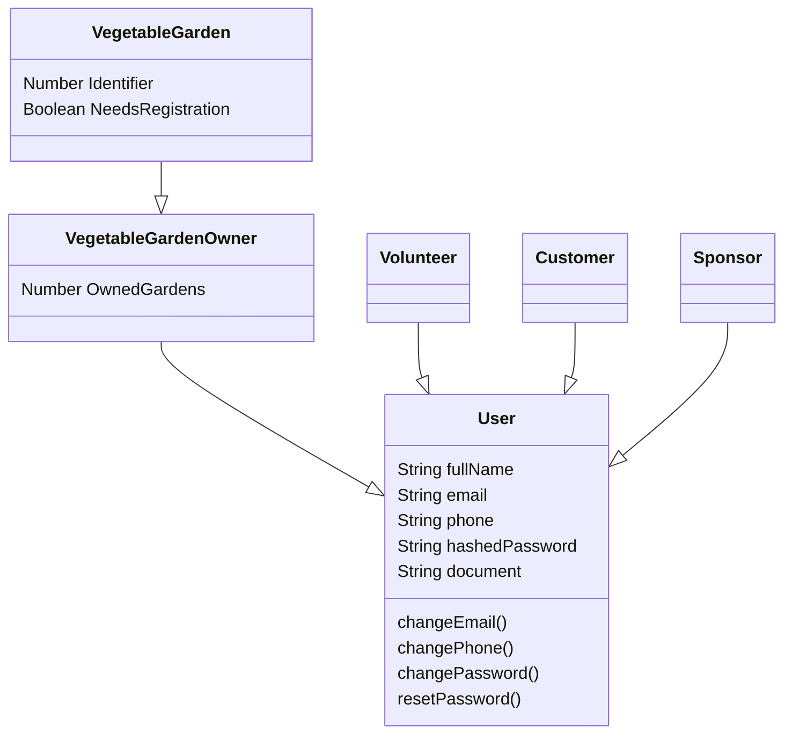

# AHorta
 
[Figma](https://www.figma.com/design/K3yrC3UNvrpjKnlH1XHnsG/Projeto-FIAP?node-id=0-1&node-type=canvas&t=frSRKXJ6AT5iUrnV-0)

## UML Class Diagram

```mermaid
classDiagram
    class User {
        String fullName
        String email
        String phone
        String hashedPassword
        String document
        changeEmail()
        changePhone()
        changePassword()
        resetPassword()
    }
    VegetableGardenOwner --|> User
    class VegetableGardenOwner {
        Number OwnedGardens
    }
    Volunteer --|> User
    class Volunteer {

    }
    Customer --|> User
    class Customer {

    }
    Sponsor --|> User
    class Sponsor {

    }
    VegetableGarden  --|> VegetableGardenOwner
    class VegetableGarden {
        Number Identifier
        Boolean NeedsRegistration
    }
```